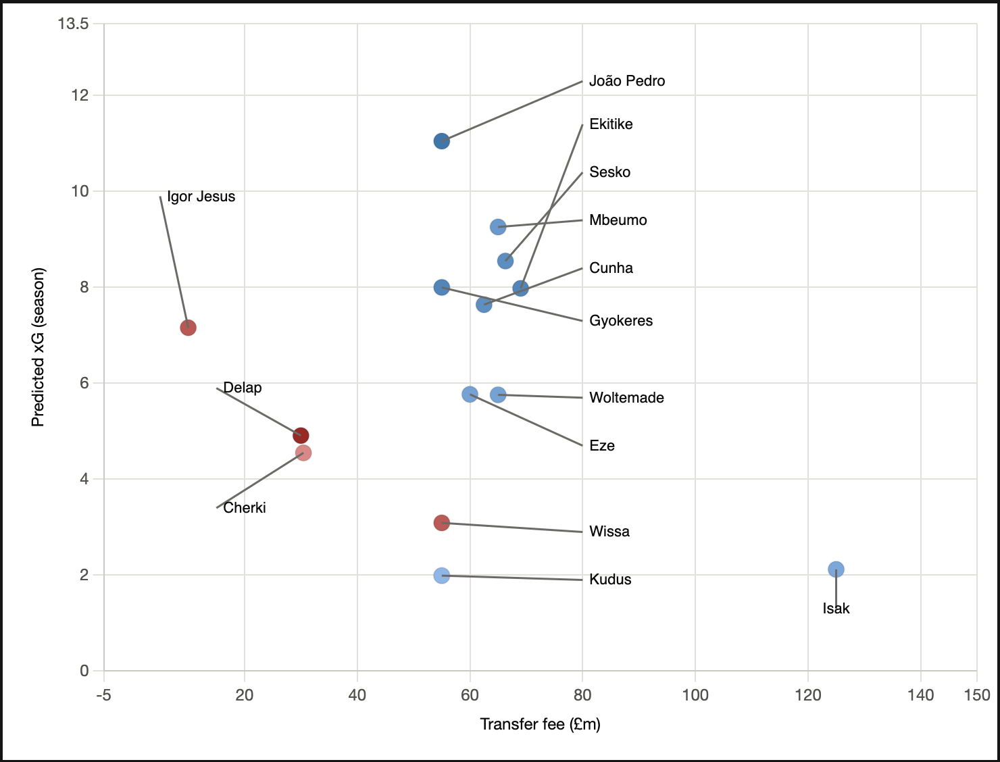

## Premier League Expected Goals (xG) & Player Valuation Model

The main aim of this project is to design a complete machine learning pipeline with raw shot data from Understat to calculate an expected goals (xG) score for non-penalty shots across the Premier League. The selected Logistic Regression model achieved an ROC-AUC of 0.7504, providing strong discrimination and a well-calibrated goal probability distribution from 0.01 to 0.99. Pair this with the market value of the players, and it becomes clear that there are definite recruitment inefficiencies in the organisation (such as the underachieving Liam Delap (-3.91 xG_diff) vs the elite efficient João Pedro (+3.95 xG_diff)).

 

**Key Project Highlights**

* End-to-end data pipeline, built from an undocumented API: Reverse-engineered Understat's internal data endpoints — identifying the correct Referer and X-Requested-With headers required to bypass access restrictions — to scrape shot-level data across all 380 matches of the 2025/26 Premier League season (9,524 shots total).
* Geometry-based feature engineering: Derived shot distance and shot angle from raw pitch coordinates using Pythagorean and arctan2-based trigonometry, rather than relying on pre-existing xG values, to build features genuinely predictive of goal probability.
* Model comparison is rigorous, using Logistic Regression, a benchmarking model compared to a `HistGradientBoostingClassifier` model on a stratified train/test split. Logistic Regression was the top model (ROC-AUC 0.7504, log-loss 0.2806) and its predictions were found to be highly correlated with those of Understat's own published xG model (Pearson 0.7558).
* Real-world value analysis: Applied the trained model to 14 confirmed 2025 transfer events from the Premier League to compare the actual transfer value with xG_diff (actual goals scored minus predicted xG) to see whether signings were likely to be over or undervalued — such as Liam Delap (£30m, -3.91 xG_diff) vs João Pedro (£55m, +3.95 xG_diff).
* Custom interactive visualization: Built an interactive Plotly shot map from scratch (no pre-built pitch library), including manually-derived pitch geometry, hover tooltips showing shot-level xG and outcome, and correctly scaled coordinate systems.


**Tech Stack**

* Data Acquisition & Web Scraping: requests, json
* Data Processing & Feature Engineering: pandas, numpy (vectorized Euclidean distance and arctan2 trigonometric angle calculations)
* Machine Learning & Modeling: scikit-learn (LogisticRegression, HistGradientBoostingClassifier, train_test_split, roc_auc_score, log_loss)
* Data Visualization: plotly (plotly.graph_objects), matplotlib, mplsoccer
* Environment & Version Control: VS Code, Git, GitHub


**Phase 1: Data Acquisition & API Reverse-Engineering**

The project began by extracting raw event data directly from Understat's undocumented backend API, rather than relying on clean, pre-packaged datasets. The underlying data endpoint isn't intended for direct external access — it's designed to only respond to requests originating from the site's own front-end JavaScript — so standard scraping attempts were rejected by the server. To overcome this, I monitored the site's network traffic and injected the necessary Referer and X-Requested-With headers into my Python pipeline, effectively mimicking browser behavior to unlock the full season's dataset.


**Phase 2: Feature Engineering**

Rather than relying on Understat's proprietary xG values, I built the model's predictive power from first principles by engineering custom spatial features directly from raw pitch coordinates. Using vectorized NumPy operations, I applied the Pythagorean theorem to calculate the Euclidean distance to the center of the goal and arctan2 trigonometry to derive the visible shooting angle. To complete the feature set, I one-hot encoded contextual variables — such as shot situation and body part — and established a clean binary target variable to classify whether each shot resulted in a goal, explicitly excluding penalties (a fixed, non-representative shot type) and own goals (a defensive error rather than a successful attacking shot) to keep the training data representative of genuine open-play/set-piece shooting ability.


**Phase 3: Model Training, Comparison and Evaluation**

To ensure that the distribution of goals to non-goals was maintained, I ran an 80-20 training-test split before running two different algorithms: an 80/20 train/test split of the `HistGradientBoostingClassifier` and the standard `LogisticRegression`. Although the tree model was able to capture non-linear interactions, it performed worse than the Logistic Regression model, which obtained 0.7504 on the ROC-AUC and 0.2806 on the Log-Loss. This is an important domain knowledge: The probability of a shot to make a goal is smooth and monotonic in terms of the distance and angle of the shot. Logistic Regression naturally captures this gradual decay, while tree based models have the potential to over fit the inherent noise in football data, giving rise to the creation of hard, step-like decision boundaries.

**Phase 4: Analysis & Storytelling**

In the final phase, I aggregated shot-level xG predictions across the full season to evaluate net finishing performance (xG_diff = Goals − predicted xG) against actual transfer fees paid for a curated cohort of 14 Premier League forwards from the 2025 summer transfer window. This revealed striking market inefficiencies, separating undervalued, clinical finishers from high-volume underperformers. To effectively communicate these insights, I developed both static pitch maps using matplotlib/mplsoccer and custom, fully responsive interactive shot maps in Plotly, featuring hover tooltips and dynamic marker styling to contextualize individual shot selection.


## Visualizations

**Below:** an interactive shot map for Liam Delap (hover to see xG, outcome, and coordinates per shot), and a transfer value scatter plot comparing fee paid against predicted xG, colored by over/underperformance.




## Repo Structure

The repository is structured to keep the end-to-end pipeline reproducible, containing the raw data extract, the unified Python workflow, and generated visual assets:

```text
├── .gitignore                    # Prevents unnecessary cache and environment files from being tracked
├── season_shots.json             # Scraped raw shot-level dataset across all 380 Premier League matches
├── xg_model.py                   # Complete, self-contained Python script executing all 4 phases
├── interactive_shotmap.png       # Screenshot demonstrating the custom Plotly interactive pitch map and tooltips
├── transfer_value_scatter_v2.png    # Screenshot visualizing the transfer fee vs. xG_diff market analysis
└── README.md                     # Project documentation, methodology, and case study
```

## Future Improvements

* Advanced Defensive Context: This model utilizes shot geometry (Distance, Angle) and it currently does not have freeze frame data. A 360-degree tracking or event data that would cover the proximity to defenders and positioning of the goalkeepers would greatly improve the accuracy of xG predictions.
* Environment Resolution & XGBoost Integration: Due to local environment dependency conflicts, XGBoost was left out of the final algorithm benchmarking. Resolving these to properly test XGBoost alongside HistGradientBoostingClassifier and the top-performing LogisticRegression model could unlock further performance gains.
* Expanded Transfer Market Analysis: Scaling the data pipeline to ingest multiple seasons or other Top 5 European leagues would expand the sample size. This would allow for more robust, cross-market efficiency comparisons beyond just the 14 Premier League forwards in the 2025 summer window.
*  Interactive Dashboard Deployment: Converting the Plotly visualizations from script output to a deployed web application (e.g., with Streamlit). This would mean that players could switch between seasons and players and corresponding interactive maps.
