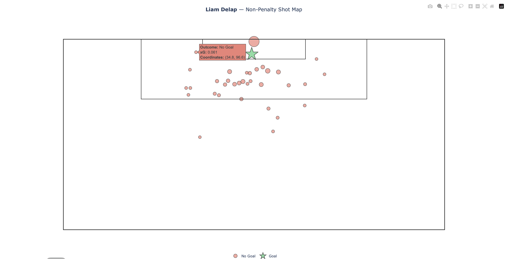

The main aim of this project is to design a complete machine learning pipeline with raw shot data from Understat to calculate an expected goals (xG) score for non-penalty shots across the Premier League. The baseline classification model performed with an ROC-AUC of 0.7504, thus providing good discrimination and a good calibration of the goal probability distribution from 0.01 to 0.99. When coupled with player value, the model identifies opportunities in the market for inefficiencies (the "underperforming" Liam Delap (-3.91 xG_diff) against the "elite efficiency" João Pedro (+3.95 xG_diff) for instance).

 

Key Project Highlights
* End-to-end data pipeline, built from an undocumented API: Reverse-engineered Understat's internal data endpoints — identifying the correct Referer and X-Requested-With headers required to bypass access restrictions — to scrape shot-level data across all 380 matches of the 2025/26 Premier League season (9,524 shots total).
* Geometry-based feature engineering: Derived shot distance and shot angle from raw pitch coordinates using Pythagorean and arctan2-based trigonometry, rather than relying on pre-existing xG values, to build features genuinely predictive of goal probability.
* Rigorous model comparison: Benchmarked Logistic Regression against a HistGradientBoostingClassifier on a stratified train/test split; Logistic Regression performed best (ROC-AUC 0.7504, log-loss 0.2806), and its predictions correlated at 0.7558 (Pearson) with Understat's own published xG model.
* Real-world value analysis: Applied the trained model to 14 verified summer 2025 Premier League transfers, comparing actual transfer fees against xG_diff (goals scored minus predicted xG) to identify likely over- and under-performing signings — e.g. Liam Delap (£30m, -3.91 xG_diff) vs. João Pedro (£55m, +3.95 xG_diff).
* Custom interactive visualization: Built an interactive Plotly shot map from scratch (no pre-built pitch library), including manually-derived pitch geometry, hover tooltips showing shot-level xG and outcome, and correctly scaled coordinate systems.

Tech Stack
* Data Acquisition & Web Scraping: requests, json
* Data Processing & Feature Engineering: pandas, numpy (vectorized Euclidean distance and arctan2 trigonometric angle calculations)
* Machine Learning & Modeling: scikit-learn (LogisticRegression, HistGradientBoostingClassifier, train_test_split, roc_auc_score, log_loss)
* Data Visualization: plotly (plotly.graph_objects), matplotlib, mplsoccer
* Environment & Version Control: VS Code, Git, GitHub

Phase 1: Data Acquisition & API Reverse-Engineering
The project began by extracting raw event data directly from Understat's undocumented backend API, rather than relying on clean, pre-packaged datasets. The underlying data endpoint isn't intended for direct external access — it's designed to only respond to requests originating from the site's own front-end JavaScript — so standard scraping attempts were rejected by the server. To overcome this, I monitored the site's network traffic and injected the necessary Referer and X-Requested-With headers into my Python pipeline, effectively mimicking browser behavior to unlock the full season's dataset.

Phase 2: Feature Engineering
Rather than relying on Understat's proprietary xG values, I built the model's predictive power from first principles by engineering custom spatial features directly from raw pitch coordinates. Using vectorized NumPy operations, I applied the Pythagorean theorem to calculate the Euclidean distance to the center of the goal and arctan2 trigonometry to derive the visible shooting angle. To complete the feature set, I one-hot encoded contextual variables — such as shot situation and body part — and established a clean binary target variable to classify whether each shot resulted in a goal, explicitly excluding penalties (a fixed, non-representative shot type) and own goals (a defensive error rather than a successful attacking shot) to keep the training data representative of genuine open-play/set-piece shooting ability.

Phase 3: Model Training, Comparison and Evaluation
To preserve the natural distribution of goals to non-goals, I utilized a stratified 80/20 train/test split before benchmarking two distinct algorithms: a `HistGradientBoostingClassifier` and a standard `LogisticRegression`. Despite the tree-based model's ability to handle non-linear interactions, the simpler Logistic Regression outperformed it, achieving an ROC-AUC of 0.7504 and a log-loss of 0.2806. This highlights a key domain insight: the relationship between shot geometry (distance, angle) and goal probability is fundamentally smooth and monotonic. Logistic Regression naturally captures this gradual decay, whereas tree-based models can overfit the inherent noise of football data by creating rigid, step-like decision boundaries.

Phase 4: Analysis & Storytelling
In the final phase, I aggregated shot-level xG predictions across the full season to evaluate net finishing performance (xG_diff = Goals − predicted xG) against actual transfer fees paid for a curated cohort of 14 Premier League forwards from the 2025 summer transfer window. This revealed striking market inefficiencies, separating undervalued, clinical finishers from high-volume underperformers. To effectively communicate these insights, I developed both static pitch maps using matplotlib/mplsoccer and custom, fully responsive interactive shot maps in Plotly, featuring hover tooltips and dynamic marker styling to contextualize individual shot selection.

